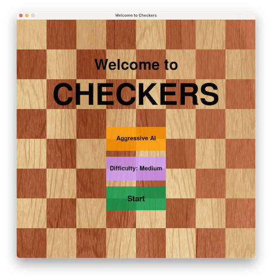
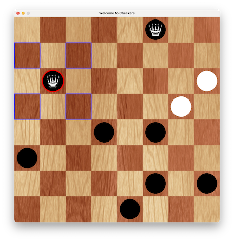
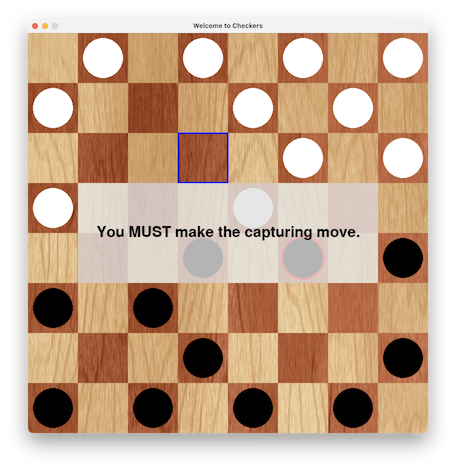

# Python checkers

*March 2022*

Python implementation of AI checkers, including minimax with alpha-beta pruning. This was my final project for **Intelligent Systems Techniques** taken at the University of Sussex for my MSc in AI and Adaptive Systems.

# Introduction

This paper discusses my implementation for creating an checkers game playable between a human and the computer. Specifically, the computer uses the minimax algorithm with alpha-beta pruning (Russell & Norvig, 2022)[^1] in order to perform a search on possible likely future game states; this AI uses a heuristic (or a combination of multiple heuristics) in order to evaluate each game state and determine the best move given the constraints.

In section 1.1, I describe my program design: how classes are organized, important methods in each class, the overall flow of the program, and so forth. In section 2, I describe how my implementation addresses the marking criteria, including describing the specifics of the minimax search algorithm, the heuristics or static evaluation function I use, and other important game internals. Specific lines in the source code are referenced in section 2.

## 1.1 Program Design

My program is structured as a series of hierarchical classes that are all controlled by a main game event loop in Pygame. Pygame is a set of highly portable open-source Python modules that provide a framework for building graphical games (Shinners, 2011)[^2]. When the user runs “main.py”, the program initializes a Pygame window, draws the required screen components (initially the splash or menu screen), and starts monitoring for events like user mouse clicks. The program also initializes a CheckersGame object, which is the top-level controller for game logic. Each important class is described here.

- **CheckersGame** This is the top-most class that controls game logic. In contains a Board object, as well as game state variables like current the current player, the difficulty level, how aggressive the AI is, if there is a winner, and so on. This class also contains methods for drawing the splash screen buttons, handling user mouse clicks, and drawing user feedback windows (like when a forced-capture move is required). Importantly, this class also contains the method for the AI move (line 369), i.e. the minimax algorithm with alpha-beta pruning. This algorithm is described in section 2.2.

- **Board** A Board object is owned by a CheckersGame object, and owns virtually all the logic of the checkers game; which moves are legal, where pieces are located on the board, which piece (if any) is selected for movement, methods to move a piece, etc. The board object uses a 2D numpy array of piece objects as the data structure to store game state. The board object also has some methods that are critical to the minimax algorithm; namely, the board can get a list of all possible subsequent board positions by determining all legal moves, and can also return a static evaluation or heuristic determining how good a given board state is. Again, this discussed in detail in section 2.2. The board also has methods to handle drawing itself in the pygame window.

- **Piece** This class defines the actual checkers pieces. Each piece has attributes to keep track of various state variables, like position on the board (row, column), color (black or white), and whether or not the piece is a king. A Piece object can receive (x,y) coordinates of a mouse click on the board to determine if it is being selected, and can also draw itself in the pygame window.

There is also a “constants.py” file, which contains (you guessed it) constants used by the game. This includes things like RGB color values, the size of game components like checkers tiles and pieces. This file also loads game assets into memory, like images used for drawing board tiles, game fonts, and icons for designating a piece as a king.

Lastly, the “main.py” file also contains a special function called make_centroid_plots(). This function creates a series of checkers game in which the AI plays itself, and collects data to subsequently graph. This is described more in section 2.2, and specifically deals with the static evaluation function used by the AI to determine how good a given board position is.

# 2 Description of Program Functionality

In this section, I address how my implementation addresses the marking criteria. The GUI elements are all self-evident, and thus I focus on the game internals.

- **(a)** The splash screen is displayed on start, and allows the user to change AI difficulty level (easy, medium, or hard), AI gameplay style (normal or aggressive), and start the game.

- **(b)** A piece is outlined in red when selected by the user for move- ment. Legal moves are outlined in blue. In this example, a king is selected, and thus can move to any of the four diagonal tiles.

## 2.1 Gameplay

*Figure 1a: The splash screen is displayed on start, and allows the user to change AI difficulty level (easy, medium, or hard), AI gameplay style (normal or aggressive), and start the game.*

*Figure 1b: A piece is outlined in red when selected by the user for movement. Legal moves are outlined in blue. In this example, a king is selected, and thus can move to any of the four diagonal tiles.*

This program is in interactive checkers game between a human user and a computer. Figure 1b is a screenshot from the game illustrating interactive gameplay; in this case, the user has selected a black king for movement. The piece is outlined in red, indicating it is selected. The legal moves are outlines in blue (a king can move forwards or backwards). Every time a user selects a piece, the available moves are outlines in blue. The user always plays the black pieces, and thus always goes first. The computer automatically makes a move after the user.

There are different levels of AI cleverness, adjustable by the user on the splash screen (figure 1a) before a game has commenced. The AI difficulty can be set to “Easy”, “Medium”, or “Hard”. The harder the AI, the longer it will take to make a move. The specifics of how the AI difficulty is related to the number of static evaluations made by the minimax algorithm, and is discussed in section 2.2. Additionally, the AI can be set to be more aggressive. The more aggressive the AI, the more it will favor attacking as opposed to defensive play. This is also discussed in the last part of section 2.2.

## 2.2 Minimax search algorithm and static evaluation heuristics

The AI uses the minimax algorithm with alpha-beta pruning, as described by Russell and Norvig (2022). The minimax algorithm is a recursive algorithm that is used to find the optimal move for a player, assuming the other player also moves optimally. The algorithm searches a decision tree where each node corresponds to a board state and each branch from a node represents a possible move. Thus a given depth of the decision tree will correspond to all possible moves that white can move; the subsequent level will correspond to all moves that black could make given all those possible white moves. While in theory this tree could be explored exhaustively, this is of course computationally impossible for all but the smallest games, of which checkers is not included. How does the minimax algorithm know when to stop evaluating possible subsequent moves?

The algorithm employs a static evaluation function or heuristic to determine how good a given game state is (see the method static_evaluation() in the Board class, line 223). Once the algorithm has reached a certain depth (or a certain number of static evaluations have been made), the algorithm returns the static evaluation and corresponding game state. The recursive calls are backtracked. Two players are needed for the minimax algorithm to work; one seeks to maximize the static evaluation, and the other who seeks to minimize the static evaluation. I implemented a static evaluation that uses two heuristics. The first is component is straightforward: white pieces are assigned a value of 1 and black pieces are assigned a value of -1 (king pieces are weighted 2 and -2, respectively). The static evaluation of a given board state is the sum of all the piece values. White seeks to maximize this sum, while black seeks to minimize it.

The second part of the heuristic can be toggled on or off by the user on the splash screen, and controls how aggressive the AI player is. The heuristic works by first calculating the geometric centroid of the pieces for each player (see the method distance_between_centroids() in the Board class on line 192). In Cartesian coordinates, the centroid is just the mean of the components. The Euclidean distance between both centroids is then calculated, and this value is subtracted from the static evaluation. Remember that white is the maximizing player; thus white seeks to minimize this distance. Importantly, when the black player computes a static evaluation in the minimax algorithm, the aggressive heuristic is not incorporated, because although the white player might be adjusting gameplay to be more aggressive, we don’t necessarily want the black player to be modeled as either minimizing or maximizing the distance between centroids; in other words, the black player should just play “normally” and not incorporate centroid distance into gameplay decisions.

<figure align="center">
    
    <figcaption>Figure 2: Comparing the incorporation of an aggressive gameplay heuristic into the AI player static evaluation function. In one set of experiments both AI players played normally (orange lines), while in the other set the white AI player incorporated the aggressive heuristic into it’s static evaluation function (blue lines). Difficulty level for both AI players was set to medium. There are a total of 10 simulations shown by the transparent lines; thick lines are averages across all simulation runs.</figcaption>
     
</figure>

Figure 2 shows how gameplay is affected when the white player is aggressive. I had the AI play itself; in one set of experiments both AI players played normally (orange lines), while in the other set the white AI player incorporated the aggressive heuristic into it’s static evaluation function (blue lines). Difficulty level for both AI players was set to medium. I ran 10 simulations for 20 turns each. The transparent lines represent individual simulation runs, while the thick lines represent the average across all simulations. As expected, when the white AI player is aggressive (blue lines), the centroid distance is smaller then when the white AI player is not aggressive. Interestingly, we see that when the white AI is aggressive, on average more white pieces and more black pieces are left on the board for a given turn. However, the effect is larger for the white player, and thus it appears that aggressive gameplay results in better overall performance for an AI player. Of course, this does not take into effect the psychological effect on a human player when playing against an aggressive AI opponent! That is, unfortunately, outside the scope of this report.

Alpha-beta pruning is implemented in order to shrink the size of the search tree by culling branches that don’t need to be explored.

## 2.3 Successor function

A successor function is used to generate possible next moves from a given board state. The method that performs this is get_possible_next_moves(player) and is found in the Board class, line 321. It takes a player indicator (1 for white, -1 for black) for whom to calculate moves for, and returns possible moves

Figure 2: Comparing the incorporation of an aggressive gameplay heuristic into the AI player static evaluation function. In one set of experiments both AI players played normally (orange lines), while in the other set the white AI player incorporated the aggressive heuristic into it’s static evaluation function (blue lines). Difficulty level for both AI players was set to medium. There are a total of 10 simulations shown by the transparent lines; thick lines are averages across all simulation runs.

as new Board objects. This method works by essentially iterating over every tile in the checkers board; if a given tile has a piece of the appropriate player on it, it re-iterates over all the tiles again and determines if a move if legitimate (and if a capture is in order). Once this has been completed, we have a list of all possible moves. If any capture moves are possible, then these are exclusively returned; in this way, forced capture is implemented. Otherwise, all possible moves are returned. This list represents the next depth level in the minimax search tree. I chose to shuffle this list of possible subsequent board configurations; otherwise, the AI would always navigate the search tree in the same order, and would preferentially move pieces in the top left of the board (as these are added to the possible moves list first).

## 2.4 Difficulty level

The difficulty is controlled in two ways; firstly, we can limit how deep the minimax algorithm will move down the search tree of possible subsequent moves before making a static evaluation. In essence, this controls how far into the future of possible game states the AI player will look. However, the size of the search tree grows geometrically, and thus large depth limits are computationally prohibitive. Thus, the depth limit is set to 5 for the “Easy” AI, and 6 for the “Medium” and “Hard” AI difficulty levels.

A better approach is to put a hard limit on the number of static evaluations made by the AI. I have arbitrarily set these to 5000, 7500, and 10000 for the “Easy”, “Medium”, and “Hard” difficulty levels, respectively. The minimax algorithm, as I explained in section 2.2, will automatically return a static evaluation when the max depth limit is hit. However, the algorithm will now also return a static evaluation when a certain number of static evaluations have already been made. This is, in effect, controlling the breadth of the decision tree explored (while the depth limit controls the depth, of course). As explained in section 2.3, this is the reason the list of possible subsequent moves is shuffled, because it’s possible not every possible branch will be explored and we don’t want to preferentially explore moves originating from a certain location of the board.

## 2.5 Validation of moves

Just as the successor function (section 2.3) only generates legal valid moves for the AI player, human moves are similarly validated and rejected if illegal. Likewise, forced capture is implemented: if a capture is possible, the user must make the capture. The Game class handles the user mouse clicks to select (or deselect) a piece. Every time a piece is selected, the legal moves are updated. This is handled by the method update_legal_moves() in the Board class on line 89. Similar to how the successor function determines possible AI moves, the update_legal_moves() method iterates over all tiles and determines if it’s a legal destination for the selected player. If any capture moves are possible, only these moves are returned; otherwise the list of all legal moves are returned. If there is more than one capturing opportunity at the same time, the player may choose which one to take.

*Figure 3a: If the human player tries to make a move for a given piece when another piece can make a capturing move, a pop-up reminder is displayed and the forced capture move is shown.*

*Figure 3b: Forced capture is implemented for both the AI and human players. From a UI standpoint, if a capture is possible, it is shown as the only legal move for a given selected piece. In this case, a capture is the only valid move shown for the selected black king.*

The list of legal moves are displayed to the user as a blue outline around each legal tile. If a user tries to make an illegal move, the selected piece is simply deselected.

## 2.6 Other features

I have implemented a few other features to allow for appropriate checkers gameplay. For example, a piece is automatically converted into a king when it reaches baseline, as per the normal rules. As this point, a piece is permitted to move “backwards”. In addition, I have implemented regicide: if a normal piece manages to capture a king, that piece is instantly crowned a king and the current turn ends.

[^1]: Russell, S., & Norvig, P. (2022). Artificial intelligence: A modern approach (4th ed.). Pearson.
[^2]: Shinners, P. (2011). Pygame. [http://pygame.org/](http://pygame.org/).